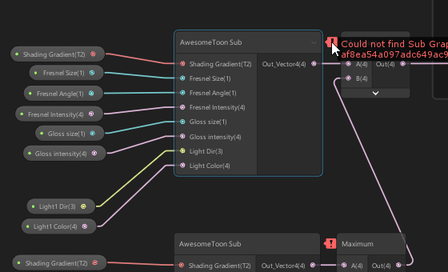
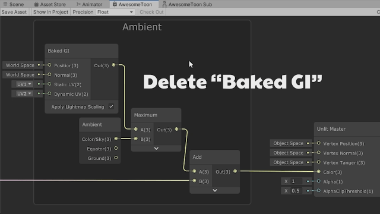

# Awesome Toon Shader
A character focused Toon Shader for Unity using Shader Graph. Using a C# helper script on the object to supply lighting data to the material, making it flexible and programmable. While it's not the most optimised and ideal approach for every scenario, it's a different take on toon shading and passing lighting data.

Improvements, forks and pull requests are welcome. Be sure to check out the tutorial to follow the process of building this shader from scratch.

### Tutorial
How to build this shader from scratch:
- Part 1: https://youtu.be/g8eBXCgWwrk
- Part 2: https://youtu.be/CVhyQHJPK7M

### Awesomeness & Features
- Supports multiple light sources and types.
- Adjustable shading bands.
- Beautiful gloss and Fresnel effects.
- Shade detection with Raycasting ("faking" reciving shadows on an unlit material).

### Drawbacks
- Not ideal for enviroment shading (In it's current configuration, could be repurposed to work better).
- Doesn't receive shadows directly, but fakes it by turning light sources off/on, by testing visibility with raycasting.
- Lighting is relative to the mesh center rather than the mesh surface position. This difference is usually not noticable, apart from when you are standing on top of a light source.

# How to use
1. Apply the `AwesomeToonHelper` script to your character (On the Game object with the **Mesh renderer**)
2. Create a material with the `AwesomeToon` shader, and set this as the `SourceMaterial` input on the `Awesome Toon Helper` component.
3. On the material set a `Shading Gradient` to one of the gradients in this repo, or make your own.
4. Play around!

### Material instancing (Sharing material between many characters)
By default the script will take a copy of your material and apply it to the model. Any changes to this copy (instance) will not be retained, this allows many characters to share the same source material and have individual lighting data. If you are **making changes to the source material**, uncheck `instance material` temporarily.

# Troubleshoot

### Error: Could not find Sub Graph...

If the `Awesome Toon Sub` node is not found in the `Awesome Toon` shader, delete it and add it back in again, then save.

### Everything looks bright and washedout

Depending on the lighting setup of your scene, you might have to delete the "Baked GI" node for things to look right.

